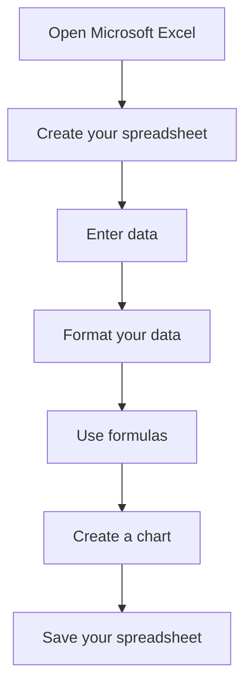

# How to Make a Spreadsheet in Excel

1. Open Microsoft Excel. You can open Excel by clicking the Start button and selecting All Programs followed by Microsoft Excel.

2. Create your spreadsheet. To create a blank spreadsheet, click the “File” tab and select “New.” Choose a template or select “Blank Workbook” to create a new spreadsheet.

3. Enter data. To enter data into your spreadsheet, type into each cell. To move to the next cell, press Enter or the Tab key.

4. Format your data. To format your data, select the cells you want to format. Then click the “Home” tab and choose a font, font size, bold, italicize, or underline the text.

5. Use formulas. To use formulas, type in the formula into a cell. For example, to add two cells, type “=A1+B1.”

6. Create a chart. To create a chart, select the data you want to chart and click the “Insert” tab. Then select the chart type you want to create and click “OK.”

