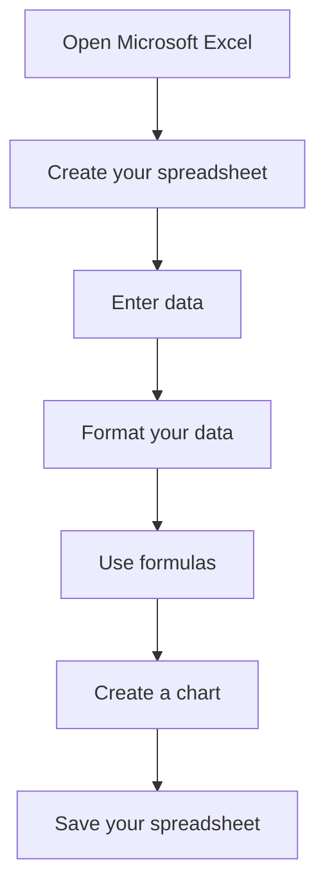

# How to Make a Spreadsheet in Excel

1. Open Microsoft Excel. You can open Excel by clicking the Start button and selecting All Programs followed by Microsoft Excel.

2. Create your spreadsheet. To create a blank spreadsheet, click the “File” tab and select “New.” Choose a template or select “Blank Workbook” to create a new spreadsheet.

3. Enter data. To enter data into your spreadsheet, type into each cell. To move to the next cell, press Enter or the Tab key.

4. Format your data. To format your data, select the cells you want to format. Then click the “Home” tab and choose a font, font size, bold, italicize, or underline the text.

5. Use formulas. To use formulas, type in the formula into a cell. For example, to add two cells, type “=A1+B1.”

6. Create a chart. To create a chart, select the data you want to chart and click the “Insert” tab. Then select the chart type you want to create and click “OK.”

# Excel Basics

Getting started with Excel is easy, but it's important to understand some basic concepts first.

## Cells

In Excel, the spreadsheet is made up of individual cells, which are the squares where you enter data. The columns are labeled with letters (A, B, C, etc.), and the rows are numbered (1, 2, 3, etc.).

## Range

If you select a group of cells, it is called a range. You can perform operations on the range as a whole, such as applying formatting or performing calculations.

## Zoom

You can adjust the zoom level of the sheet by clicking on the View tab and using the Zoom options. This can be helpful when working with large or complex spreadsheets.

## Adjusting Cell Size

To adjust the size of a cell, click on the line between two column or row headers and drag it to the desired size. This can be helpful when you need to fit more content into a cell, or when you want to make a cell smaller to fit in more data on the sheet.

## Editing Cells

To edit a cell, simply click on it and start typing. You can also double-click on a

