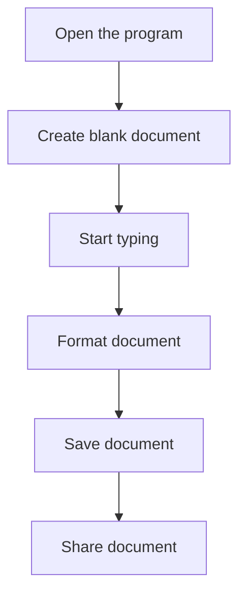

# How to Use Word 365
Word 365 is a powerful word processing program that is part of the Microsoft Office Suite. Here is how to get started using Word 365:

- Open the program. On a PC, you can find Word 365 in the Windows Start menu. On a Mac, you can find Word 365 in the Applications folder.
- Once the program is open, you can create a blank document by going to the “File” menu and selecting “New.”
- Start typing in the blank document to create your document. Word 365 has a variety of formatting and layout options that you can use to customize your document.
- When you are done, you can save your document by going to the “File” menu and selecting “Save As.”
- You can also share your document with others by going to the “Share” menu and selecting “Share.”

